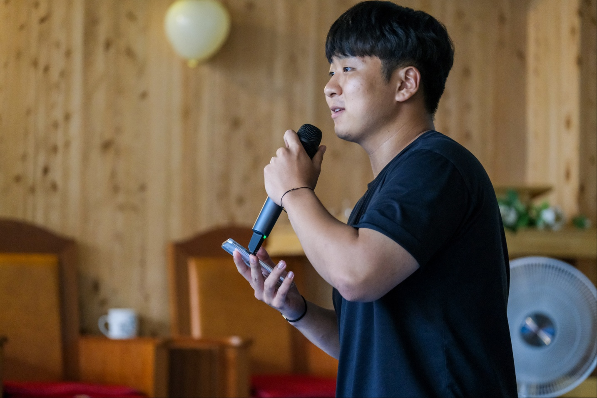
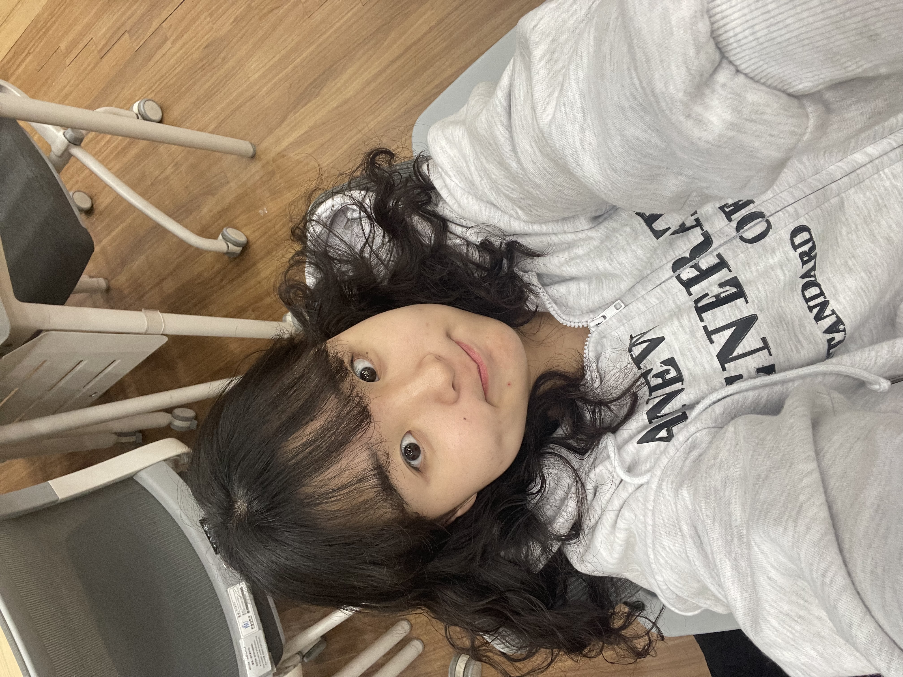
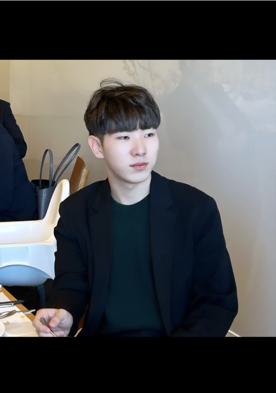

  

# ActionPoint_WEB

# ActionPoint (액션포인트)

 
<h2>✔️ 회의부터 실행 계획까지 체계적으로 돕는 가이드 서비스</h2>
 

**그래서 오늘 무슨 얘기했지? 나 뭐 해야한다고??!** 
💬 팀 프로젝트를 하는 대학생들은 회의 과정에서, 그리고 실행계획을 세우는 것에 어려움을 겪습니다. 액션포인트는 회의 템플릿, 달성률 시각화 및 동기부여 기능을 통해 회의부터 실행까지 체계적으로 이어지도록 돕는 서비스입니다.

 

---

### 문제
저희는 [팀프로젝트에 익숙하지 않은 대학생들]이  
[회의를 처음부터 끝까지 체계적으로 진행하는 방법을 모르기] 때문에 
[구체적인 실행계획을 세우지 않아 결국 프로젝트가 지연되는 문제]를 겪고 있다고 생각합니다.

### 🎯 타겟 🎯
- 의미없이 끝나는 회의가 반복되어 실행으로 이어지지 않는 것에 답답함을 느끼는 대학생
- 회의를 단순한 대화가 아닌, 진짜 실행으로 연결되는 시간으로 만들고 싶은 대학생
- 회의 때마다 무슨 이야기를 했는지 정리가 안 되고, 결국 "나 뭐 해야 하지?" 하고 방황하는 대학생

### ★ 솔루션 ★

1. 오늘의 회의 안건과 그에 맞는 회의록을 작성할 수 있도록 도와줍니다.

2. 회의에서 나온 액션포인트를 한 눈에 확인하고 프로젝트 별로, 회의 별로도 볼 수 있도록 합니다.

3. 액션포인트 완료 여부에 맞춰 진행률과 그에 맞는 동기부여 멘트를 제공합니다.

 

### ♥ 팀원 소개 ♥

| 🪽 김제람 🪽 | ❣️ 김사랑 ❣️ | 🐻 조상근 🐻 |
|:-----------:|:-----------:|:--------------:|
| PM | Designer | Backend |
|  |  |  |
| ☃️ 김솔미 ☃️ | 🔥 박하솔 🔥 | 😎 최옥토 😎 |
| Frontend | Frontend | Frontend |
|  |  |  |

---

## 🔗 Deployment Link

☀️ **Frontend**  
[ActionPoint FE](https://github.com/Club-PARD/ActionPoint_FE.git)

🌕 **Backend**  
[ActionPoint BE](https://github.com/Club-PARD/ActionPoint_BE.git)

---

## 🛠 개발환경

  
   
  
  
  
  

---

## 📺 서비스 화면 구성 📺

### ✅ 메인 페이지
<table align="center">
<tr>
<th>프로젝트가 없을 때</th>
<th>프로젝트가 있을 때</th>
</tr>
<tr>
<td align="center">

</td>
<td align="center">

</td>
</tr>
</table>

### ✅ 프로젝트 추가

  
  
  

프로젝트 생성 모달

  
  

프로젝트 참여 모달

### ✅ 회의록 페이지

  
  
  

회의록 생성

  
  

생성 후의 서기 view

  

회의록 수정 기능

  

회의록 최종 페이지

